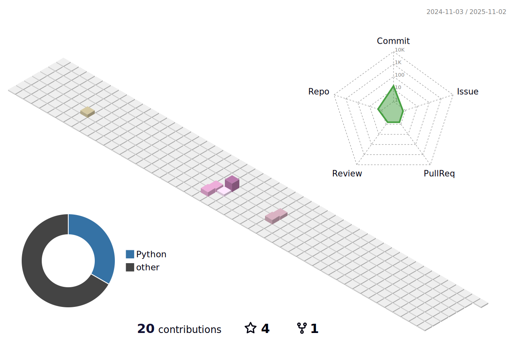

## 📞 Contact

 

## 🤔 Skills 
### Programming Languages 💻
 
     
     

### Tools 🧰
 
    
    
    
    
    
    
    
    
    
    
    

### Data Mining 🗄️
<block>
  
    
     
     
    
    
    
    
    
      
  
</block>  

## 📑 GitHub Status 

## 🏅 Solved.ac 

<!--
**moheemohaeng/moheemohaeng** is a ✨ _special_ ✨ repository because its `README.md` (this file) appears on your GitHub profile.

Here are some ideas to get you started:

- 🔭 I’m currently working on ...
- 🌱 I’m currently learning ...
- 👯 I’m looking to collaborate on ...
- 🤔 I’m looking for help with ...
- 💬 Ask me about ...
- 📫 How to reach me: ...
- 😄 Pronouns: ...
- ⚡ Fun fact: ...
-->
